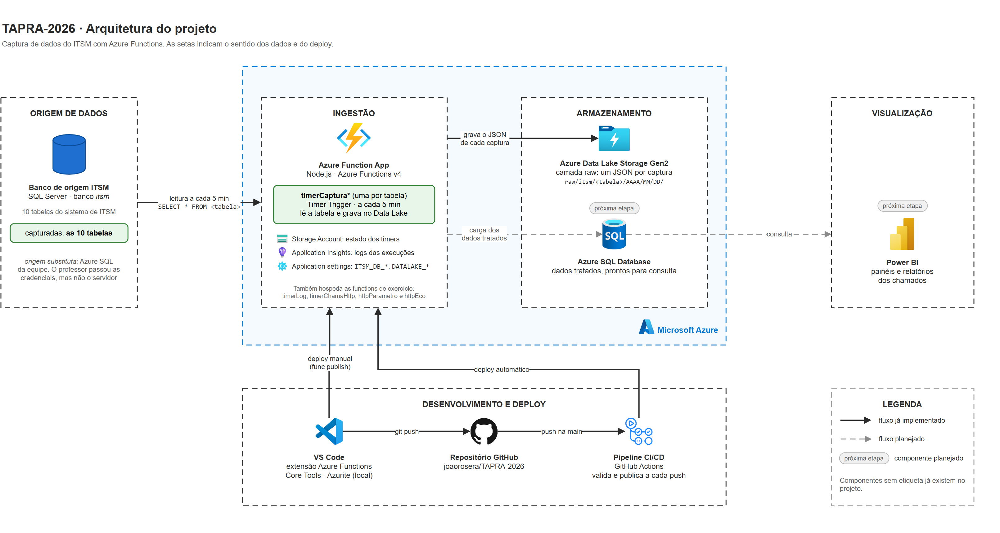

# TAPRA-2026

Projeto da disciplina TAPRA (2026) com Azure Functions usando os gatilhos **Timer Trigger** e **HTTP Trigger**, incluindo a captura de dados das 10 tabelas do banco de origem (SQL Server, banco `itsm`) e a gravação desses dados no Data Lake.

## Integrantes da equipe

- João Vitor Rosera
- Vinicius Werner ([@lvwerner](https://github.com/lvwerner))

## Tecnologias

- Azure Functions v4 (modelo de programação Node.js v4)
- Node.js / JavaScript
- Azure Functions Core Tools v4
- Azurite (emulador de storage, necessário para os timer triggers rodarem localmente)
- SQL Server / Azure SQL (banco de origem `itsm`), acessado com o driver [`mssql`](https://www.npmjs.com/package/mssql)
- Azure Data Lake Storage Gen2 (camada *raw*), acessado com o SDK [`@azure/storage-blob`](https://www.npmjs.com/package/@azure/storage-blob). No ambiente local, o Azurite faz esse papel
- GitHub Actions (pipeline de validação e publicação)

## Arquitetura



O desenho foi feito no draw.io e está em [`docs/arquitetura.drawio`](docs/arquitetura.drawio). Para editar, abra o arquivo em [app.diagrams.net](https://app.diagrams.net) ou na extensão *Draw.io Integration* do VS Code e, depois de salvar, exporte de novo para `docs/arquitetura.png` (*File > Export as > PNG*).

A arquitetura é dividida em camadas, e as setas indicam o sentido dos dados e do deploy. Componentes com a etiqueta *próxima etapa* e setas tracejadas ainda não foram implementados.

- **Origem de dados:** banco `itsm` (SQL Server), fornecido pelo professor. As 10 tabelas são capturadas, cada uma pela sua function.
- **Ingestão:** a **Function App** (Node.js, Azure Functions v4) executa as functions de captura (`timerCaptura*`, uma por tabela) a cada 5 minutos: cada uma abre a conexão com o banco, lê a sua tabela, fecha a conexão e grava os dados no Data Lake. As credenciais ficam nas *Application settings* (`local.settings.json` no ambiente local, fora do Git), os logs vão para o **Application Insights** e o **Storage Account** (Azurite no ambiente local) guarda o estado dos timers. A mesma Function App hospeda as functions de exercício (`timerLog`, `timerChamaHttp`, `httpParametro` e `httpEco`).
- **Armazenamento:** cada captura vira um arquivo JSON na camada *raw* do **Azure Data Lake Storage Gen2**, em `raw/itsm/<tabela>/AAAA/MM/DD/`. A carga dos dados tratados no **Azure SQL Database**, pronta para consulta, é a próxima etapa.
- **Visualização** *(próxima etapa)*: painéis e relatórios no **Power BI**, consultando o Azure SQL Database.
- **Desenvolvimento e deploy:** o código é escrito no **VS Code** (Core Tools e Azurite para rodar localmente) e versionado no **GitHub**. O pipeline do **GitHub Actions** valida as functions a cada push e publica a Function App a cada push na `main` (veja [Pipeline (GitHub Actions)](#pipeline-github-actions)). O deploy manual (`func azure functionapp publish`) continua disponível.

## Functions do projeto

| Function | Gatilho | O que faz |
| --- | --- | --- |
| `timerLog` | Timer (a cada 1 minuto) | Imprime apenas um log no terminal a cada execução. |
| `httpParametro` | HTTP GET `/api/parametro?nome=Valor` | Recebe um parâmetro pela URL e imprime esse parâmetro na tela. |
| `httpEco` | HTTP GET `/api/eco?mensagem=Texto` | Retorna a informação recebida acrescida de um texto de identificação. |
| `timerChamaHttp` | Timer (a cada 2 minutos) | Faz uma chamada HTTP para a function `httpEco` e imprime a resposta no log. |
| `timerCaptura*` (10 functions) | Timer (a cada 5 minutos) | Cada uma captura os dados de uma tabela do banco de origem `itsm` e grava um arquivo JSON no Data Lake. Lista na seção 5. |

### 1. `timerLog` — Timer Trigger

Arquivo: [`src/functions/timerLog.js`](src/functions/timerLog.js)

Executa a cada 1 minuto (NCRONTAB `0 */1 * * * *`) e escreve uma linha no terminal:

```
[timerLog] TAPRA-2026 | execucao agendada em 2026-09-09T18:30:00.012Z
```

### 2. `httpParametro` — HTTP Trigger

Arquivo: [`src/functions/httpParametro.js`](src/functions/httpParametro.js)

Recebe o parâmetro `nome` pela query string do método GET, imprime no log e devolve na tela:

```
GET http://localhost:7071/api/parametro?nome=Joao
-> Parametro recebido: Joao
```

Se o parâmetro não for informado, retorna HTTP 400 com uma mensagem explicando o formato esperado.

### 3. `httpEco` — HTTP Trigger (chamada pelo timer)

Arquivo: [`src/functions/httpEco.js`](src/functions/httpEco.js)

Recebe o parâmetro `mensagem` e retorna a informação recebida junto de um texto de identificação:

```
GET http://localhost:7071/api/eco?mensagem=teste
-> [httpEco - TAPRA-2026] Recebi a seguinte mensagem: "teste"
```

### 4. `timerChamaHttp` — Timer Trigger que chama outra Azure Function

Arquivo: [`src/functions/timerChamaHttp.js`](src/functions/timerChamaHttp.js)

A cada 2 minutos monta uma mensagem, faz uma chamada HTTP para a function `httpEco` e imprime a resposta no terminal:

```
[timerChamaHttp] chamando a function httpEco: http://localhost:7071/api/eco?mensagem=...
[timerChamaHttp] resposta (HTTP 200): [httpEco - TAPRA-2026] Recebi a seguinte mensagem: "chamada do timerChamaHttp em 2026-09-09T18:32:00.008Z"
```

A URL de destino vem da configuração `ECO_FUNCTION_URL`, para que o mesmo código funcione localmente e publicado no Azure.

### 5. `timerCaptura*` — Timer Triggers que capturam as tabelas do banco de origem e gravam no Data Lake

Há uma function para cada tabela do banco `itsm`:

| Function | Tabela |
| --- | --- |
| [`timerCapturaAnalistas`](src/functions/timerCapturaAnalistas.js) | `analista` |
| [`timerCapturaCategorias`](src/functions/timerCapturaCategorias.js) | `categoria` |
| [`timerCapturaChamados`](src/functions/timerCapturaChamados.js) | `chamado` |
| [`timerCapturaChamadosSla`](src/functions/timerCapturaChamadosSla.js) | `chamado_sla` |
| [`timerCapturaChamadosStatusHistorico`](src/functions/timerCapturaChamadosStatusHistorico.js) | `chamado_status_historico` |
| [`timerCapturaClientesOrganizacao`](src/functions/timerCapturaClientesOrganizacao.js) | `cliente_organizacao` |
| [`timerCapturaCsatAvaliacoes`](src/functions/timerCapturaCsatAvaliacoes.js) | `csat_avaliacao` |
| [`timerCapturaFilas`](src/functions/timerCapturaFilas.js) | `fila` |
| [`timerCapturaSlas`](src/functions/timerCapturaSlas.js) | `sla` |
| [`timerCapturaSolicitantes`](src/functions/timerCapturaSolicitantes.js) | `solicitante` |

Cada arquivo só define o agendamento e o nome da tabela. A lógica de captura é a mesma para todas e fica em [`src/lib/capturaTabela.js`](src/lib/capturaTabela.js), fora de `src/functions/` porque todo `.js` daquela pasta é carregado como function pelo host. Para capturar uma tabela nova, basta criar mais um arquivo no mesmo formato.

A cada 5 minutos (NCRONTAB `0 */5 * * * *`) cada function:

1. confere as variáveis de ambiente `ITSM_DB_*` e `DATALAKE_CONNECTION_STRING` (nenhuma credencial fica no código);
2. abre uma conexão com o banco de origem `itsm` (SQL Server / Azure SQL);
3. executa `SELECT * FROM <tabela>`;
4. encerra a conexão;
5. imprime no log a quantidade de registros capturados, as colunas e os primeiros registros;
6. grava a captura como um arquivo JSON na camada *raw* do Data Lake.

```
[timerCapturaChamados] abrindo conexao com o banco itsm
[timerCapturaChamados] conexao encerrada
[timerCapturaChamados] <N> registro(s) capturado(s) da tabela chamado
[timerCapturaChamados] colunas: id_chamado, titulo, ...
[timerCapturaChamados] primeiros registros: [{"id_chamado":1, ...}]
[timerCapturaChamados] dados gravados no Data Lake: raw/itsm/chamado/2026/10/01/chamado_20261001T190500Z.json
```

Cada execução cria um arquivo novo no container `raw` (configurável por `DATALAKE_CONTAINER`), separado por tabela e por data, com os metadados da captura e os registros como vieram do banco:

```json
{
  "origem": "itsm",
  "tabela": "chamado",
  "capturadoEm": "2026-10-01T19:05:00.012Z",
  "quantidade": 2,
  "registros": [{ "id_chamado": 1, "titulo": "..." }, { "id_chamado": 2, "titulo": "..." }]
}
```

Se faltar alguma variável obrigatória, a execução registra um erro com o **nome** das variáveis ausentes (nunca os valores) e não tenta conectar. Se o erro do banco trouxer o valor do usuário ou da senha (como o `Login failed for user '...'` do SQL Server), o log mostra só o nome da variável no lugar.

## Como executar localmente

Pré-requisitos: [Node.js 20 ou 22 LTS](https://nodejs.org) (versões suportadas pelo Azure Functions v4) e [Azure Functions Core Tools v4](https://learn.microsoft.com/azure/azure-functions/functions-run-local) — o Core Tools e o Azurite já vêm como `devDependencies` deste projeto.

```bash
git clone https://github.com/<usuario>/TAPRA-2026.git
cd TAPRA-2026
npm install
cp local.settings.json.example local.settings.json   # no Windows: copy local.settings.json.example local.settings.json
```

Edite o `local.settings.json` e preencha as variáveis `ITSM_DB_*` com os dados de acesso ao banco `itsm`. As variáveis `DATALAKE_*` já vêm apontando para o Azurite. Esse arquivo está no `.gitignore` e **não deve ser commitado**. Somente o modelo `local.settings.json.example`, com valores de exemplo, fica no repositório.

Os timer triggers precisam de uma conta de storage. Para desenvolvimento local, suba o emulador Azurite em um terminal:

```bash
npm run azurite
```

O script usa `--skipApiVersionCheck` e grava os dados do emulador em `../.azurite-tapra-2026`, **fora da pasta do projeto**. As duas coisas são de propósito.

O `--skipApiVersionCheck` existe porque o `@azure/storage-blob` negocia uma versão da API de storage mais nova do que o Azurite conhece — mesmo na última versão publicada dele. Sem o flag, a gravação no Data Lake falha **só no ambiente local**, com `The API version ... is not supported by Azurite`. O Storage real do Azure aceita a versão, então fixar o SDK numa versão antiga faria o ambiente local divergir do publicado.

Já a pasta fora do projeto é de propósito porque o Functions host vigia a raiz do projeto para recarregar o código quando um arquivo muda; se o Azurite escrever ali dentro, cada gravação derruba o host, que ao reiniciar re-adquire o *host lock lease* — outra gravação no Azurite — e o ciclo se realimenta. O sintoma é o host reiniciando sem parar, com `No script host available` no log e HTTP 500 no endpoint de administração.

Em outro terminal, inicie as functions:

```bash
npm start
```

O host sobe em `http://localhost:7071` e expõe:

- `http://localhost:7071/api/parametro?nome=Joao`
- `http://localhost:7071/api/eco?mensagem=teste`

Os timers passam a escrever no terminal automaticamente conforme o agendamento. Para executar uma captura na hora, sem esperar os 5 minutos, chame o endpoint de administração do host local com o nome da function:

```bash
curl -X POST http://localhost:7071/admin/functions/timerCapturaChamados -H "Content-Type: application/json" -d "{}"
```

No ambiente local, o Data Lake é o próprio Azurite. Para ver os arquivos gravados, abra a extensão *Azure Storage* do VS Code ou o Azure Storage Explorer em *Emulator & Attached > Storage Accounts > (Emulator - Default Ports) > Blob Containers > raw*.

## Banco de origem para desenvolvimento

O banco `itsm` do professor exige o endereço do servidor, que não foi informado — e sem o FQDN o driver `mssql` para no DNS, antes de autenticar, então usuário e senha sozinhos não conectam. Para a captura poder ser exercitada de verdade, a equipe mantém um **Azure SQL próprio como origem substituta**, com o banco `itsm` e as 10 tabelas.

Para criar e popular as tabelas, com as variáveis `ITSM_DB_*` apontando para o servidor e um usuário que possa escrever:

```bash
node scripts/seedOrigemDev.js             # cria as tabelas que faltam e popula as vazias
node scripts/seedOrigemDev.js --recriar   # descarta as tabelas antes (apaga os dados)
```

São dados fictícios: 12 chamados com acento, `NULL`, datas em meses diferentes e todos os status do fluxo, mais os cadastros que eles referenciam (analistas, categorias, filas, solicitantes, organizações e SLAs). O `chamado_sla`, o `chamado_status_historico` e o `csat_avaliacao` são calculados a partir dos chamados, para os prazos, as transições e as avaliações baterem com as datas de cada um. O script fica em `scripts/` e **não** em `src/functions/`, porque todo `.js` daquela pasta é carregado como function pelo host; o `.funcignore` também deixa `scripts` fora do pacote publicado.

Esse banco fica no tier **Basic** de propósito. O *free offer* do Azure SQL (GP serverless) **não sustenta um timer de 5 minutos**: a consulta frequente impede o banco de pausar, ele passa a cobrar o piso de vCore 24h por dia, e os vCore-segundos gratuitos do mês acabam em pouco mais de dois dias — depois disso o banco pausa até virar o mês e a captura falha. Se recriar esse banco, não use o *free offer* com o timer ligado.

> Os schemas das tabelas são **suposições** feitas a partir dos nomes das tabelas do ITSM. Quando o schema real for conhecido, são os `CREATE TABLE` do script que precisam ser conferidos — as functions não, porque executam `SELECT *` e serializam as colunas que vierem. Trocar a origem substituta pelo banco do professor é mudar `ITSM_DB_SERVER`, `ITSM_DB_USER` e `ITSM_DB_PASSWORD`, sem alterar código.

## Configurações

| Configuração | Descrição | Valor local |
| --- | --- | --- |
| `AzureWebJobsStorage` | Conta de storage usada pelo host e pelos timer triggers | `UseDevelopmentStorage=true` (Azurite) |
| `FUNCTIONS_WORKER_RUNTIME` | Runtime da function app | `node` |
| `ECO_FUNCTION_URL` | URL da function `httpEco` chamada pelo `timerChamaHttp` | `http://localhost:7071/api/eco` |
| `ITSM_DB_SERVER` | Servidor do banco de origem | `<servidor>.database.windows.net` |
| `ITSM_DB_PORT` | Porta do SQL Server (opcional) | `1433` |
| `ITSM_DB_NAME` | Nome do banco de origem | `itsm` |
| `ITSM_DB_USER` | Usuário do banco | definido pela equipe |
| `ITSM_DB_PASSWORD` | Senha do banco | definida pela equipe |
| `ITSM_DB_ENCRYPT` | Usa conexão criptografada (TLS). Mantenha `true` no Azure SQL (opcional) | `true` |
| `ITSM_DB_TRUST_SERVER_CERTIFICATE` | Aceita certificado autoassinado. Use `true` só em SQL Server local (opcional) | `false` |
| `DATALAKE_CONNECTION_STRING` | Connection string da conta do Data Lake (ADLS Gen2) onde as capturas são gravadas | `UseDevelopmentStorage=true` (Azurite) |
| `DATALAKE_CONTAINER` | Container da camada *raw* no Data Lake (opcional) | `raw` |

Ao publicar no Azure, defina `ECO_FUNCTION_URL` nas *Application settings* da Function App apontando para `https://<nome-da-function-app>.azurewebsites.net/api/eco`, e cadastre também as variáveis `ITSM_DB_*` e `DATALAKE_*`.

> **Credenciais:** usuário e senha do banco e a connection string do Data Lake existem apenas no `local.settings.json` (ignorado pelo Git) e nas *Application settings* da Function App. Nunca coloque esses valores no código, no `local.settings.json.example` ou no README.

## Publicação no Azure

```bash
az login

# conta do Data Lake: ADLS Gen2 é uma storage account com namespace hierárquico (--hns true)
az storage account create \
  --name <conta-do-data-lake> \
  --resource-group <grupo> \
  --location brazilsouth \
  --sku Standard_LRS \
  --kind StorageV2 \
  --hns true

az functionapp create \
  --resource-group <grupo> \
  --consumption-plan-location brazilsouth \
  --runtime node \
  --runtime-version 22 \
  --functions-version 4 \
  --name <nome-da-function-app> \
  --storage-account <conta-de-storage>

az functionapp config appsettings set \
  --name <nome-da-function-app> \
  --resource-group <grupo> \
  --settings ECO_FUNCTION_URL=https://<nome-da-function-app>.azurewebsites.net/api/eco \
             ITSM_DB_SERVER=<servidor>.database.windows.net \
             ITSM_DB_NAME=itsm \
             ITSM_DB_USER=<usuario> \
             DATALAKE_CONTAINER=raw

func azure functionapp publish <nome-da-function-app>
```

Cadastre a `ITSM_DB_PASSWORD` e a `DATALAKE_CONNECTION_STRING` pelo portal (*Function App > Settings > Environment variables*) para que os segredos não fiquem no histórico do terminal. A connection string do Data Lake está em *Storage account > Security + networking > Access keys*. Se o banco for um Azure SQL, libere o acesso da Function App no firewall do servidor (*Networking > Allow Azure services and resources to access this server*).

O [`.funcignore`](.funcignore) deixa de fora da publicação a documentação, os dados do Azurite e as ferramentas do ambiente local (Core Tools e Azurite), que são grandes e não rodam no Azure.

## Pipeline (GitHub Actions)

O workflow [`.github/workflows/function-app.yml`](.github/workflows/function-app.yml) tem dois jobs:

- **Validar as functions:** roda a cada push e pull request. Instala só as dependências de produção (`npm ci --omit=dev`), verifica a sintaxe e carrega todos os arquivos de `src/functions/`.
- **Publicar no Azure:** roda a cada push na `main`, depois da validação, e publica a Function App com o [Azure Functions Action](https://github.com/Azure/functions-action). Fica pulado até a configuração abaixo ser feita.

Para ligar a publicação, depois de criar a Function App:

1. No portal, habilite *Function App > Settings > Configuration > General settings > SCM Basic Auth Publishing Credentials*. Function Apps novas vêm com essa opção desligada, e sem ela o perfil de publicação não funciona.
2. Baixe o perfil de publicação em *Function App > Overview > Get publish profile*.
3. No GitHub, em *Settings > Secrets and variables > Actions*, crie:
   - o **segredo** `AZURE_FUNCTIONAPP_PUBLISH_PROFILE`, com o conteúdo do arquivo baixado;
   - a **variável** `AZURE_FUNCTIONAPP_NAME`, com o nome da Function App.
4. Faça um push na `main` ou rode o workflow manualmente em *Actions > Function App > Run workflow*.
